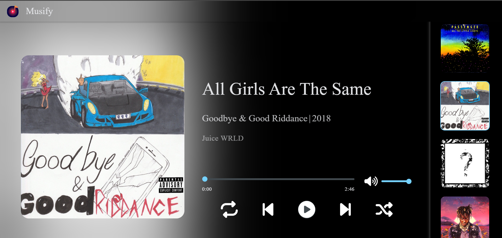

# Music Player

A sleek, interactive music player built with HTML, CSS, and JavaScript. Enjoy a clean and responsive design with essential controls for a seamless listening experience.

## Features

- Responsive Design : Looks great on both mobile and desktop devices.
- Controls : Includes functionalities for play, pause, skip, shuffle, and repeat. Easily adjust the volume or mute the music.
- Interactive UI: Sleek design that adapts to all screen sizes, providing an optimal user experience.


## Demo

Check out the live demo [here](https://siddhantmishra0.github.io/CodeAlpha_MusicPlayer/)


## Screenshots




## Installation

1. Clone the repository : 

```bash
  git clone https://github.com/siddhantmishra0/CodeAlpha_MusicPlayer.git
```

2. Open index.html in your browser.
## Tech Stack

- HTML: Used for structuring the web page.
- CSS: Used for styling the Music Player and making it visually appealing.
- JavaScript: To add interactivity and handle music player functionalities.
- Font Awesome: For incorporating visually appealing icons.

